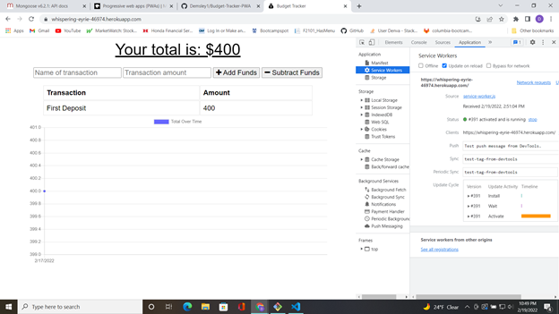
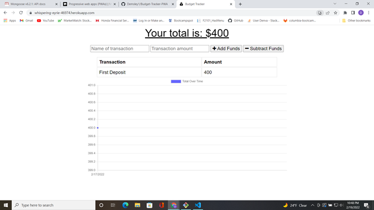

# Budget-Tracker-PWA 
  ## Description 

  With the advance of technology and of the internet many users including myself find ourselves using our phones and tablets to browse the web. This has caused new inovations and changesin web-dev from all facets, for instance in design the CSS is changed to fit all screen sizes or at least adapt when a screen grows larger and smaller. For users that like to view their favorite site on a device like a phone and cant gurantee they alwas have great connection a PWA website might just be the key. It offers all websites uses but now it's installable, looks the same, and even aves current user data when a user goes offline.

  ## Table of Contents
  In here you will find links to each section of this projects readme
  - [Installation](#installation)
  - [Usage](#usage)
  - [License](#license)
  - [Contributing](#contribution)
  - [Screenshots/Links](#screenshots/links)
  - [Questions](#questions)

  ## *Installation*

  This app is hosted live on heroku, to access it click the link provided in this readme. Also Using the link to my GitHub repo you can view the files and download them onto your local system to give them a go.

  ## Usage 

  When you are out spending and earning you want to keep track of how much money is coming and going. This app lets you do just that by submitting a name of the deposit and amount then when you click add deposit, it stores the value in the database, and shows on a graph howm uch is gained and lost. The same works for withdrawals, just click the deduct amount button to remove an amount of money from the adjusted budget. It will work online, and offline if you have a not so stable connection to the internet. Last but not least if you prefer to just use it from the home-screen of your phone it is a downloadable app as well. 

  ## Screenshots/Links

  
  
  - Live Site: [Budget-Tracker](https://whispering-eyrie-46974.herokuapp.com/)
 
  ## *License*

  Copyright 2021 &copy; Denva Emsley

      Permission to use, copy, modify, and/or distribute this software for any purpose with or without fee is hereby granted, provided that the above copyright notice and this permission notice appear in all copies.
      
      THE SOFTWARE IS PROVIDED "AS IS" AND THE AUTHOR DISCLAIMS ALL WARRANTIES WITH REGARD TO THIS SOFTWARE INCLUDING ALL IMPLIED WARRANTIES OF MERCHANTABILITY AND FITNESS. IN NO EVENT SHALL THE AUTHOR BE LIABLE FOR ANY SPECIAL, DIRECT, INDIRECT, OR CONSEQUENTIAL DAMAGES OR ANY DAMAGES WHATSOEVER RESULTING FROM LOSS OF USE, DATA OR PROFITS, WHETHER IN AN ACTION OF CONTRACT, NEGLIGENCE OR OTHER TORTIOUS ACTION, ARISING OUT OF OR IN CONNECTION WITH THE USE OR PERFORMANCE OF THIS SOFTWARE.
      

  ## Questions 

  - My GitHub username: Demsley1
  - Link to my GitHub page and repositories: [Github Link](https://github.com/Demsley1)
  _Link to my main work email if anyone should ever choose to contact me regarding work, or with helpful suggestions on how to improve this project and 
  also fix or update any major issues with project_
  - For All inquires email me at: emsley3684@gmail.com
